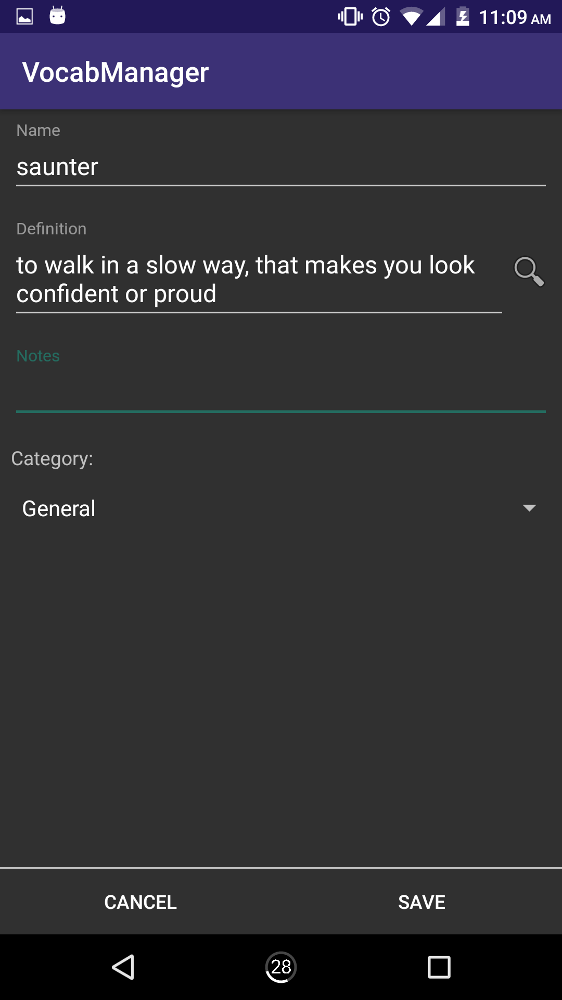
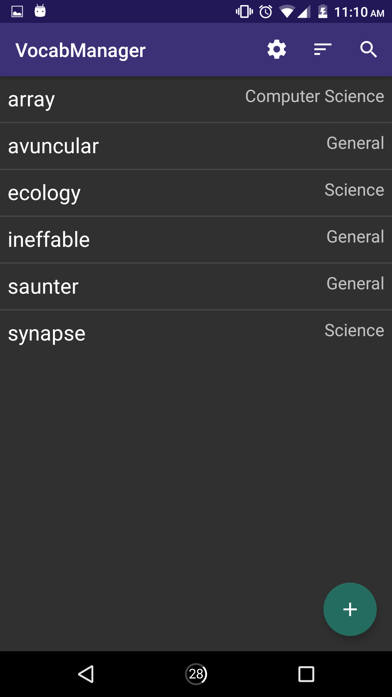
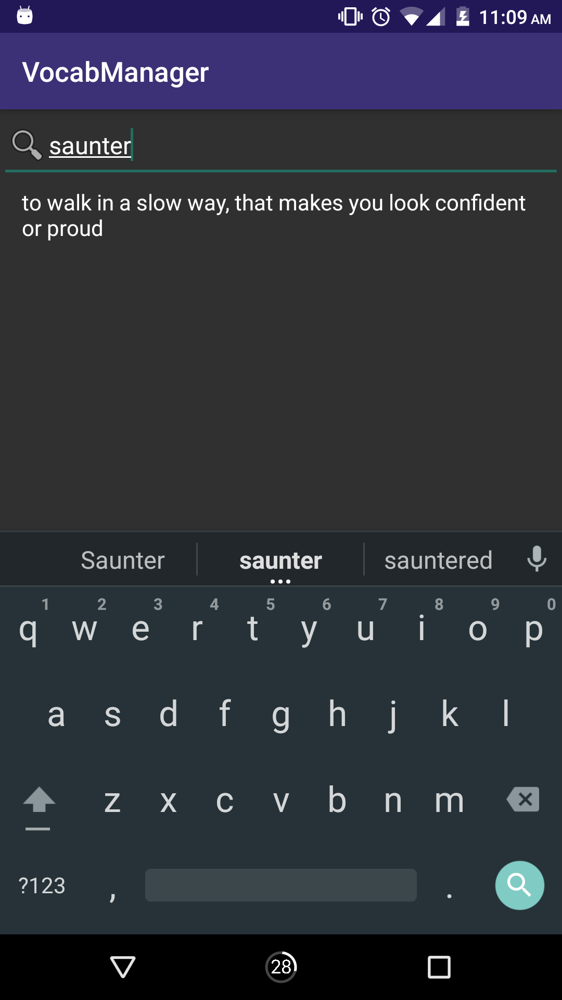

# VocabManager

Very basic app that I designed to let me keep track of interesting words that I come across.

By clicking on the search icon in the Add/Edit vocab word view, you will be able to search for definitions of the given word using Pearson's Dictionaries API:
http://developer.pearson.com/apis/dictionaries

